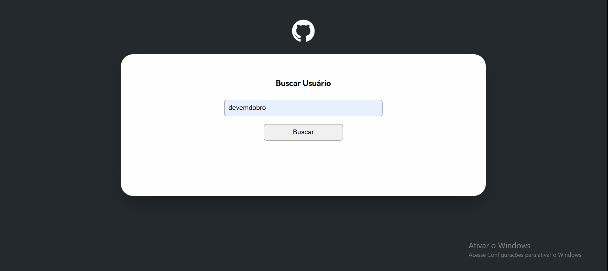
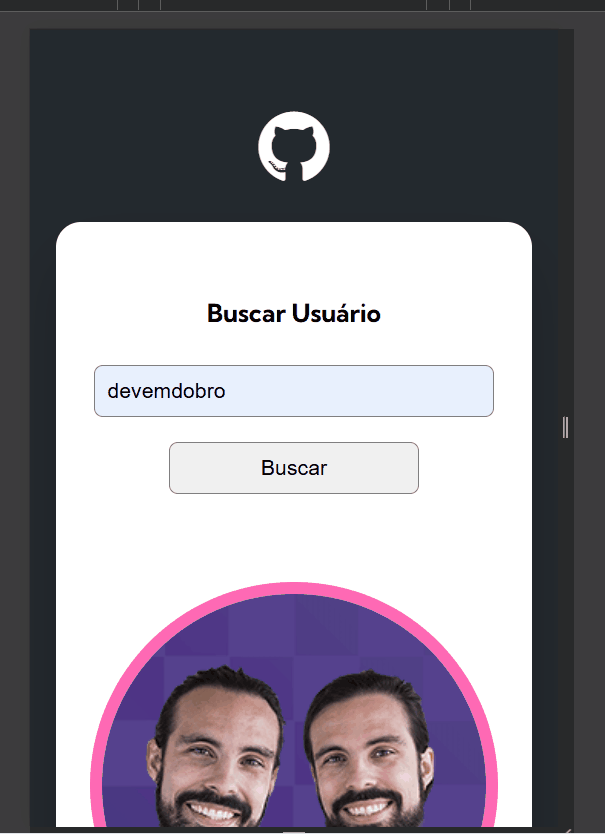

# Um projeto consumindo a API do github

Esse projeto se baseia em buscar informações dos usuários do github para mostrar na tela como os repositórios, eventos e etc.

## 💻 Design Desktop



## 📱 Design Mobile



## 🚀 Tecnologias utilizdas

- HTML
- CSS
- JavaScript

## 🔗 Clone o projeto
````
https://github.com/Ezequiel-Bomfim/fetch-github-api-.git
````
````
git@github.com:Ezequiel-Bomfim/fetch-github-api-.git
````

## 🗻 Desafios
A programação cada vez mais tem sido desafiadora, o JS tem me desafiado bastante por ser algo ainda muito novo pra mim eu tenho tido bastante dificuldade porém com o apoio e a ajuda certa estou aprendendo um pouco mais a cada desafio, vou citar alguns deles.

- Colocar os caminhos corretos para cada arquivo.

- Consumir a API.

- Buscar os eventos.

- Mostrar os resultados na tela.

- Colocar as informações dos respositórios uma ao lado da outra.

## 🧑🏽‍💻 Coisas que aprendi

Com muitos desafios vem muitos aprendizados e aqui eu vou citar alguns deles.

- Usar caminhos relativos e caminhos absolutos.

- Criar métodos próprios.

- Organizar arquivos JS em pastas e sub-pastas.

- Habilitar a tecla enter para um ouvinte de eventos.

- O return pode ser usado para parar a execução do código.

- O que é o operador de coalescência nula.

- Verficar se um objeto é um array.

- Usar o parâmetro de consulta ````per_page````.

## 🎯 Desenvolvimento contínuo

Desejo continuar evoluindo cada vez mais na programção para que eu venha ser um desenvolvedor web completo com várias habilidades  e boas práticas.

## 🙏 Agradecimentos

Venho agradecer a equipe do curso DevQuest por toda ajuda e apoio durante esse processo de aprendizado.